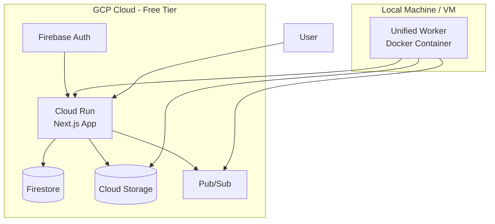
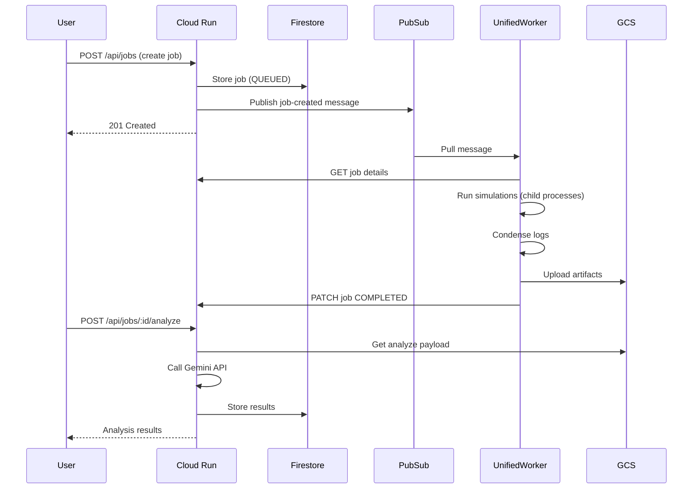
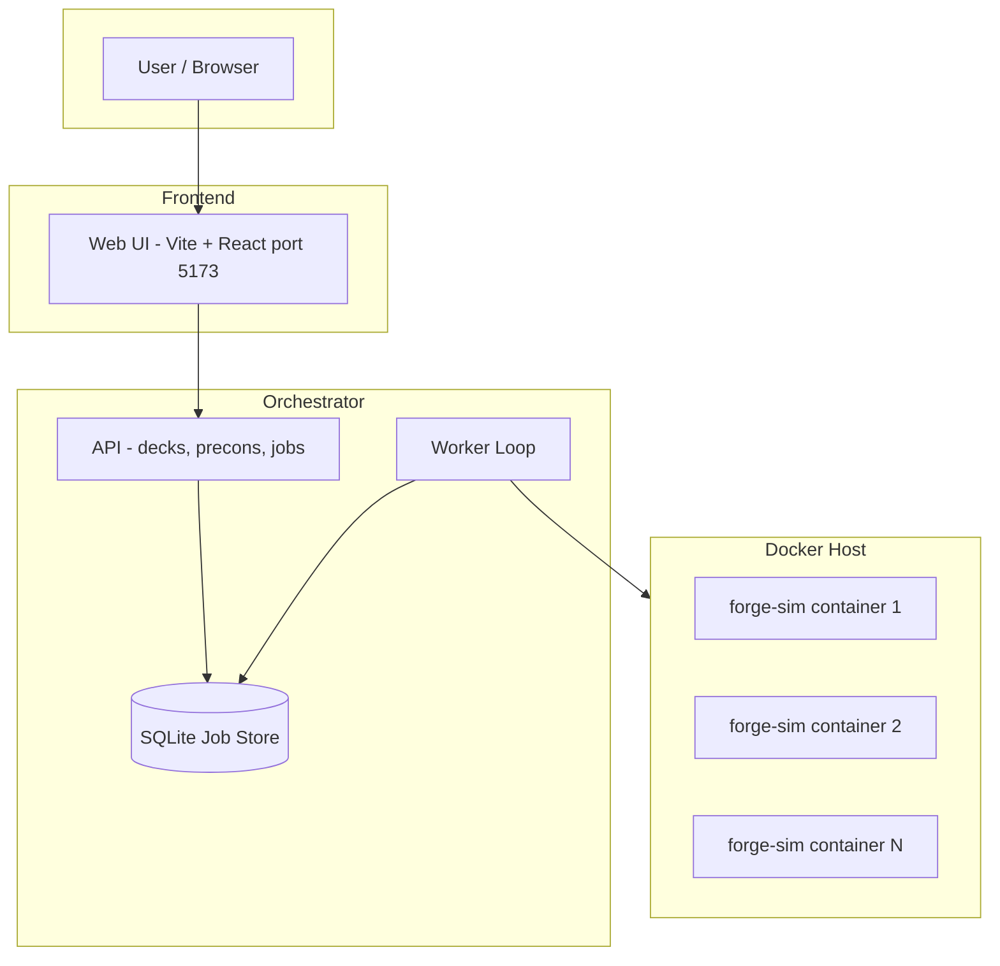
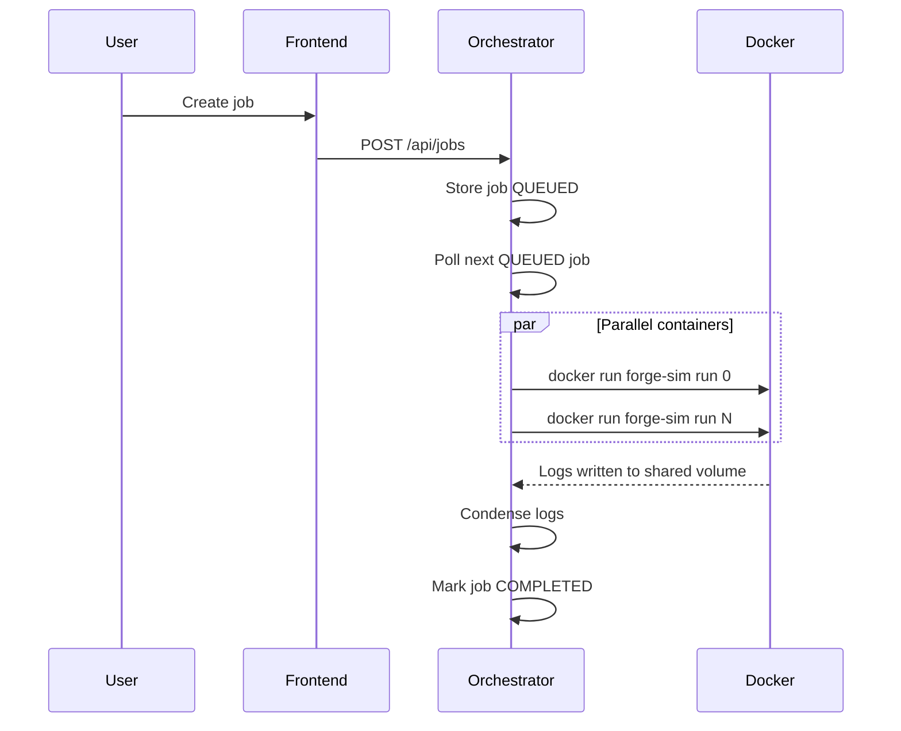

# Magic Bracket Simulator — Architecture Overview

This document describes the system architecture, with emphasis on the Docker-based Forge engine and the Unified Worker model.

---

## Deployment Modes

The system supports two deployment modes:

1. **Local Development** - All services run locally using the Orchestrator's internal worker (Docker orchestration).
2. **GCP Cloud Deployment** - Cloud Run API with a "Unified Worker" (Single container process).

---

## GCP Cloud Architecture (Recommended for Production)

### GCP Components

| Component | Service | Purpose |
|-----------|---------|---------|
| **API + Frontend** | Cloud Run | Single Next.js app serving API routes and optional frontend |
| **Job Metadata** | Firestore | Job state, deck references, results |
| **Artifacts** | Cloud Storage | Raw logs, condensed logs, analysis payloads |
| **Job Queue** | Pub/Sub | Triggers workers when jobs are created |
| **Authentication** | Firebase Auth | Google sign-in with email allowlist |

### Local Components (GCP Mode)

| Component | Directory | Purpose |
|-----------|-----------|---------|
| **Unified Worker** | `unified-worker/` | Docker image combining Node.js worker + Forge + xvfb. Pulls from Pub/Sub. |
| **Worker Source** | `local-worker/` | Source code for the Unified Worker (runs simulations as child processes). |

### GCP Data Flow

---

## Local Development Architecture (Original)

### High-Level Architecture

In this mode, the **Orchestrator Service** contains an internal worker loop (`orchestrator-service/worker/worker.ts`) that spawns `docker run` commands to execute simulations in parallel containers.

---

## Component Summary

| Component | Port | Role |
|-----------|------|------|
| **Frontend** | 5173 | Web UI (Vite + React). Calls Orchestrator API. |
| **Orchestrator** | 3000 | Next.js API + Internal Worker (Local Mode only). |
| **Unified Worker** | — | Single container running Node.js + Forge. Used in GCP Mode. |
| **Forge Sim** | — | Docker image (`forge-simulation-engine`) used by Orchestrator in Local Mode. |

---

## Data Flow (Local Mode)

---

## Repo Layout

| Directory | Purpose | Mode |
|-----------|---------|------|
| **frontend/** | Web UI (Vite + React) with Firebase Auth | Both |
| **orchestrator-service/** | Next.js API + Local Worker (Docker orchestrator) | Both |
| **local-worker/** | Source code for the Unified Worker (GCP) | GCP |
| **unified-worker/** | Docker build context for the Unified Worker | GCP |
| **forge-simulation-engine/** | Docker image for Forge (`forge-sim`) | Local |
| **misc-runner/** | (Legacy) Go container for log condensing | Legacy |
| **forge-log-analyzer/** | (Legacy) Log condensing service | Legacy |
| **analysis-service/** | (Legacy) Python + Gemini service | Legacy |

---

## Worker Implementation Details

### Local Worker (Orchestrator)
- **Source**: `orchestrator-service/worker/worker.ts`
- **Method**: Spawns `docker run` commands.
- **Concurrency**: Parallel Docker containers.
- **Use Case**: Local development where running Docker siblings is easy.

### Unified Worker (GCP)
- **Source**: `local-worker/src/worker.ts`
- **Image**: Built from `unified-worker/Dockerfile`
- **Method**: Spawns child processes (`/bin/bash run_sim.sh`).
- **Concurrency**: Parallel processes within the same container.
- **Use Case**: Deployment environments (VMs, or simple Docker hosts) where managing sibling containers is complex. Contains Forge runtime + Node.js worker in one image.
