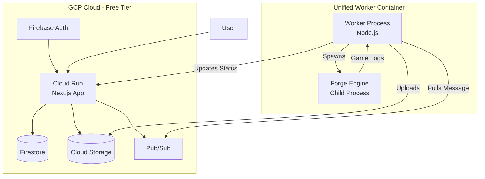
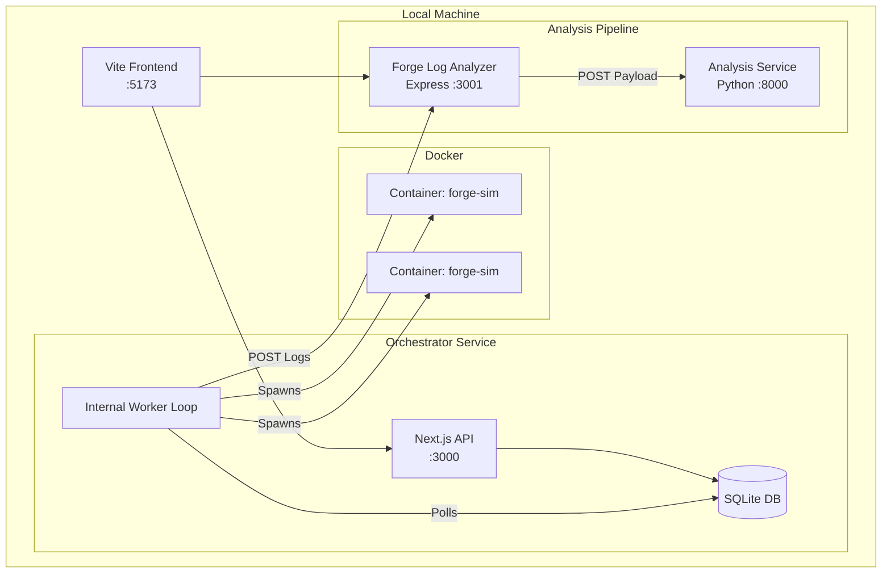

# Magic Bracket Simulator — Architecture Overview

*Last Updated: 2025-05-15*

This document describes the system architecture, which operates in two distinct modes: **Local Development** (Docker-based) and **GCP Cloud** (Serverless + Unified Worker).

---

## 1. The "Dual Mode" Architecture

The system is designed to run in two completely different configurations. It is critical to understand which mode you are operating in.

| Feature | Local Development Mode | GCP Cloud Mode |
| :--- | :--- | :--- |
| **Orchestrator** | Next.js (Local Node.js) | Cloud Run (Serverless Container) |
| **Job Queue** | SQLite (In-process polling) | Pub/Sub |
| **Worker** | **Internal Worker** (inside Orchestrator) | **Unified Worker** (`local-worker/` container) |
| **Simulation** | Spawns `docker run forge-sim` | Runs `run_sim.sh` directly (Child Process) |
| **Logs** | Local Disk (`jobs/logs`) | Google Cloud Storage (GCS) |
| **Analysis** | **Python Service** + Log Analyzer | **Orchestrator Internal** (via Gemini API) |

---

## 2. GCP Cloud Architecture (Production)

In this mode, the Orchestrator is a stateless API. The heavy lifting is done by "Unified Workers" that pull jobs from Pub/Sub.

### Component Breakdown

| Component | Directory | Role |
| :--- | :--- | :--- |
| **Orchestrator API** | `orchestrator-service/` | Handles API requests, stores job state in Firestore, pushes "Job Created" events to Pub/Sub. |
| **Unified Worker** | `local-worker/` | A standalone Node.js app. It pulls jobs, runs simulations **internally** (no Docker-in-Docker), condenses logs, and uploads artifacts to GCS. |
| **Analysis** | `orchestrator-service/lib/gemini.ts` | The Orchestrator fetches condensed logs from GCS and calls the Gemini API directly to generate brackets. |

### Data Flow (GCP)

1.  **Job Creation:** User POSTs to Orchestrator. Job saved to Firestore (QUEUED). Message published to Pub/Sub.
2.  **Execution:** Unified Worker pulls message. Fetches job details.
3.  **Simulation:** Worker spawns `run_sim.sh` (Forge) as a child process.
4.  **Log Processing:** Worker reads raw logs, condenses them (JSON), and uploads to GCS.
5.  **Completion:** Worker patches job status to COMPLETED.
6.  **Analysis:** User requests analysis. Orchestrator reads GCS payload, calls Gemini, returns results.

---

## 3. Local Development Architecture

In this mode, the Orchestrator acts as a monolith. It runs an internal worker loop that manages Docker containers on your local machine.

### Component Breakdown

| Component | Directory | Role |
| :--- | :--- | :--- |
| **Orchestrator** | `orchestrator-service/` | Runs the API *and* a background worker loop (`worker/worker.ts`). |
| **Forge Sim** | `forge-simulation-engine/` | The Docker image (`forge-sim`) used to run simulations in isolation. |
| **Log Analyzer** | `forge-log-analyzer/` | An Express app that receives raw logs from the worker, stores them on disk, and exposes them for analysis. |
| **Analysis Service** | `analysis-service/` | A Python (FastAPI/Uvicorn) service that runs the Gemini logic locally. |

### Data Flow (Local)

1.  **Job Creation:** User POSTs to Orchestrator. Job saved to SQLite.
2.  **Execution:** Internal Worker polls SQLite. Finds QUEUED job.
3.  **Simulation:** Worker spawns `docker run forge-sim` containers (one per parallel slot).
4.  **Log Processing:** Worker collects logs from disk (`jobs/logs/`), sends them to Log Analyzer (`:3001`).
5.  **Completion:** Job marked COMPLETED.
6.  **Analysis:** Frontend requests analysis via Log Analyzer (`:3001/analyze`). Log Analyzer forwards to Python Service (`:8000`).

---

## 4. Key Differences & "Gotchas"

1.  **The "Worker" Ambiguity:**
    *   In **Local Mode**, the "Worker" is a file inside Orchestrator (`worker/worker.ts`).
    *   In **GCP Mode**, the "Worker" is the code in `local-worker/` (better named "Unified Worker").

2.  **Simulation Execution:**
    *   **Local:** Uses Docker-in-Docker pattern (Orchestrator spawns Containers).
    *   **GCP:** Uses Child Processes (Worker container spawns Shell Scripts).

3.  **Log Storage:**
    *   **Local:** Filesystem (`jobs/logs`) + Log Analyzer memory/disk.
    *   **GCP:** Google Cloud Storage (Buckets).

4.  **Analysis Logic:**
    *   **Local:** Python Service (`analysis-service`).
    *   **GCP:** TypeScript Library (`lib/gemini.ts` inside Orchestrator).
