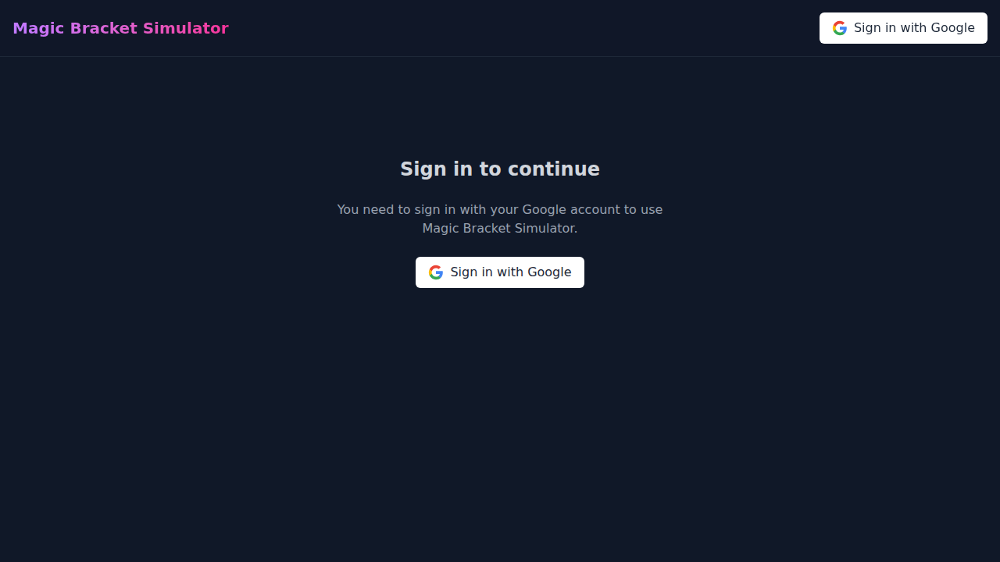

# Magic Bracket Simulator

[🚀 Launch App](https://magic-bracket-simulator.web.app) &nbsp;|&nbsp; [📖 Documentation](docs/ARCHITECTURE.md) &nbsp;|&nbsp; [🐞 Report Bug](https://github.com/TytaniumDev/MagicBracketSimulator/issues)

 
   

The ultimate Commander bracket predictor. Simulates thousands of matches in parallel using Forge, Docker, and Gemini AI to reveal the true meta.



## Quick Start

**Prerequisites:** [Node.js 20+](https://nodejs.org/), [Python 3.11+](https://www.python.org/) (with [uv](https://github.com/astral-sh/uv)), and [Docker Desktop](https://www.docker.com/products/docker-desktop/).

Run the full stack locally with just two commands. See [Deployment Guide](docs/DEPLOYMENT.md) for detailed setup.

```bash
# 1. Install dependencies
npm run install:all

# 2. Start the app (Frontend, API, Worker, Analysis)
npm run dev
```

Visit **http://localhost:5173** to start simulating.

## Key Features

*   **🤖 AI-Powered Analysis:** Uses Gemini to analyze game logs and determine power levels.
*   **⚡ Parallel Simulation:** Runs multiple Forge instances concurrently via Docker.
*   **📊 Bracket Prediction:** Automatically simulates brackets to predict tournament outcomes.
*   **☁️ Hybrid Architecture:** Runs fully locally or on Google Cloud Platform.

## Documentation Map

*   **[Architecture Overview](docs/ARCHITECTURE.md):** Deep dive into the system design, Docker worker, and data flow.
*   **[Deployment Guide](docs/DEPLOYMENT.md):** Detailed setup instructions, prerequisites, and cloud deployment.
*   **[Mode Setup](docs/MODE_SETUP.md):** Configure for Local vs GCP operation.
*   **[Secrets Setup](docs/SECRETS_SETUP.md):** How to configure API keys and credentials.

## Contributing

We welcome contributions! Please see our [Contributing Guide](CONTRIBUTING.md) to get started.
