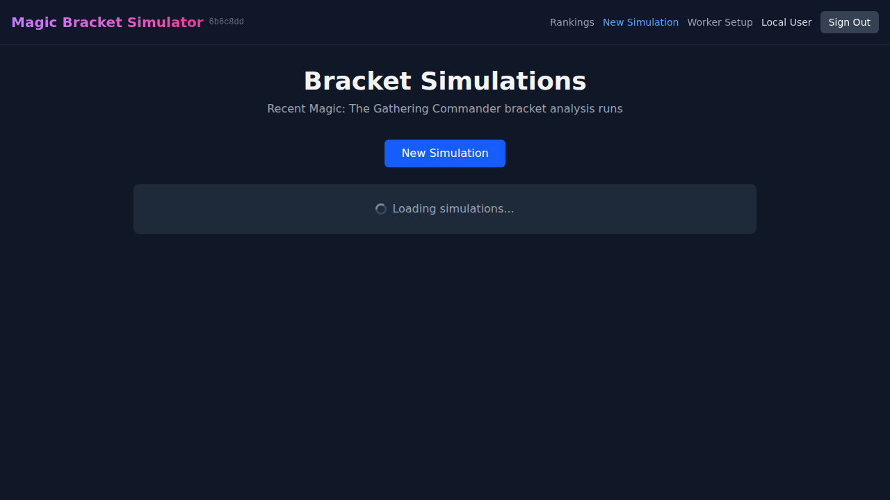

# Magic Bracket Simulator

[🚀 Launch App](https://magic-bracket-simulator.web.app) &nbsp;|&nbsp; [📖 Documentation](docs/ARCHITECTURE.md) &nbsp;|&nbsp; [🐞 Report Bug](https://github.com/TytaniumDev/MagicBracketSimulator/issues)

 

Simulate thousands of Magic: The Gathering Commander games to predict tournament brackets. Powered by Forge and Docker.



## Quick Start

Run the full stack locally.
See [Deployment Guide](docs/DEPLOYMENT.md) for detailed setup.

1. **Install dependencies:**
   ```bash
   npm run install:all
   ```

2. **Start the App (Frontend & API):**
   ```bash
   npm run dev
   ```

3. **Start the Worker (in a new terminal):**
   *Note: Requires Docker to be running.*
   ```bash
   cd worker && npm run dev
   ```

Visit **http://localhost:5173** to start simulating.

## Key Features

*   **⚡ Parallel Simulation:** Runs multiple Forge instances concurrently via Docker.
*   **📊 Win Rate Analysis:** Tracks per-deck win rates and game statistics across simulations.
*   **☁️ Hybrid Architecture:** Runs fully locally or on Google Cloud Platform.

## Documentation Map

*   **[Architecture Overview](docs/ARCHITECTURE.md):** Deep dive into the system design, Docker worker, and data flow.
*   **[API Documentation](docs/API.md):** Details about the REST API, endpoints, and data formats.
*   **[Data Flow](docs/DATA_FLOW.md):** End-to-end data flow from simulation completion through worker reporting, API aggregation, and frontend consumption.
*   **[Deployment Guide](docs/DEPLOYMENT.md):** Detailed setup instructions, prerequisites, and cloud deployment.
*   **[Mode Setup](docs/MODE_SETUP.md):** Configure for Local vs GCP operation.
*   **[Secrets Setup](docs/SECRETS_SETUP.md):** How to configure API keys and credentials.
*   **[Remote Worker Setup](docs/DEPLOYMENT.md#remote-worker-headless-machine):** Deploy the worker on a separate machine with auto-updates via Watchtower.

## Contributing

We welcome contributions! Please see our [Contributing Guide](CONTRIBUTING.md) to get started.
