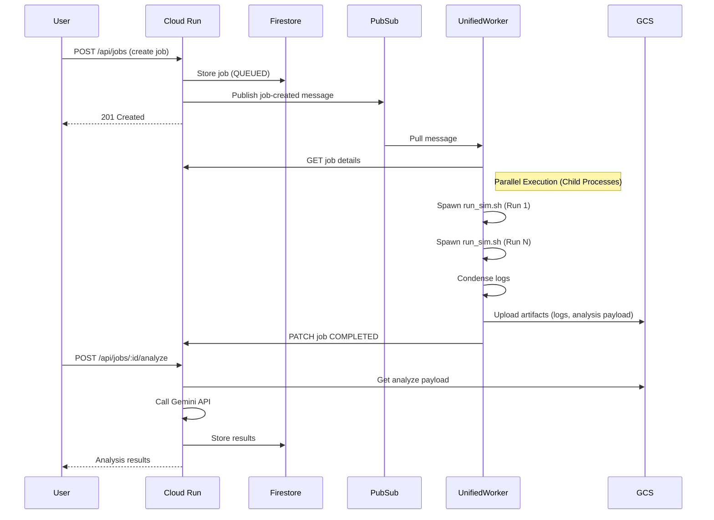
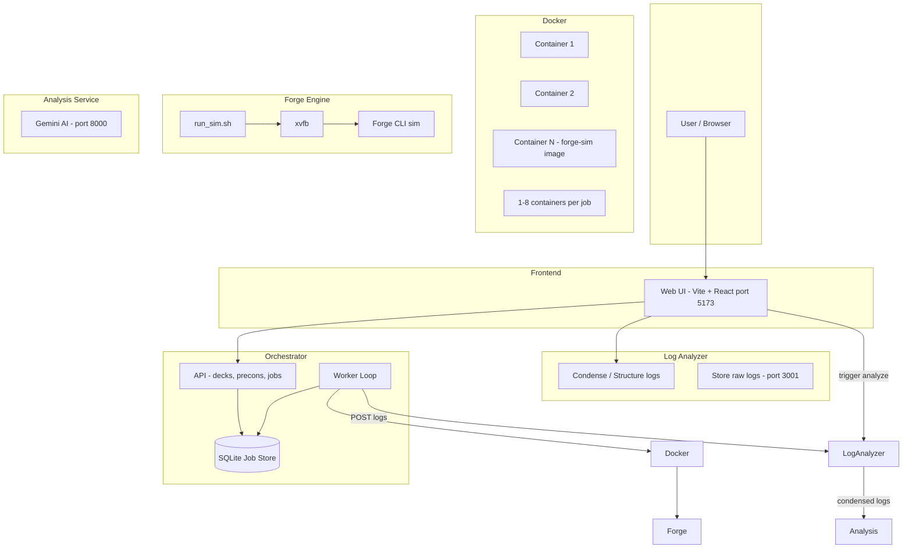
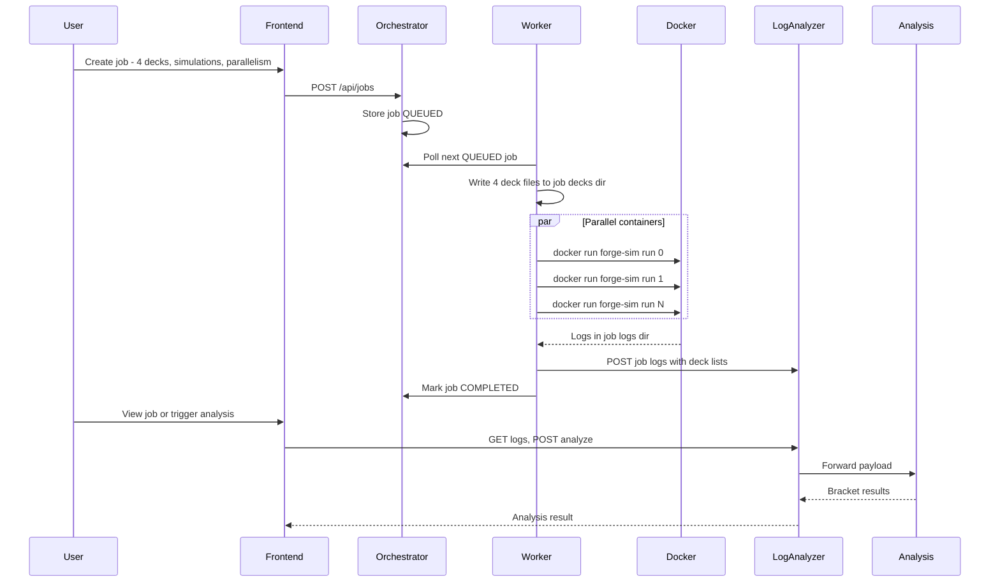

# Magic Bracket Simulator — Architecture Overview

This document describes the system architecture, with emphasis on the dual-mode operation and the Forge simulation engine.

---

## Deployment Modes

The system supports two deployment modes:

1. **Local Development** - All services run locally using Docker orchestration.
2. **GCP Cloud Deployment** - Cloud Run API with a **Unified Worker** running simulations.

---

## GCP Cloud Architecture (Recommended for Production)

In GCP Mode, the system uses a **Unified Worker** architecture. A single container image combines the Node.js worker and the Java/Forge runtime. This worker pulls jobs from Pub/Sub and executes simulations as internal child processes (not Docker-in-Docker), which improves performance and simplifies deployment.

```mermaid
flowchart TB
    subgraph gcp [GCP Cloud - Free Tier]
        CloudRun[Cloud Run<br/>Next.js App]
        Firestore[(Firestore)]
        GCS[(Cloud Storage)]
        PubSub[Pub/Sub]
        FirebaseAuth[Firebase Auth]
        SecretManager[Secret Manager]

        CloudRun --> Firestore
        CloudRun --> GCS
        CloudRun --> PubSub
        FirebaseAuth --> CloudRun
        SecretManager -.-> CloudRun
    end

    subgraph worker_env [Worker Environment (Local or Cloud)]
        UnifiedWorker[Unified Worker Container<br/>Node.js + Java + Forge]

        UnifiedWorker -- Pull --> PubSub
        UnifiedWorker -- Upload Logs --> GCS
        UnifiedWorker -- Get/Update Job --> CloudRun
        SecretManager -.-> UnifiedWorker
    end

    User --> CloudRun
```

### GCP Components

| Component | Service | Purpose |
|-----------|---------|---------|
| **API + Frontend** | Cloud Run | Single Next.js app serving API routes and optional frontend |
| **Job Metadata** | Firestore | Job state, deck references, results |
| **Artifacts** | Cloud Storage | Raw logs, condensed logs, analysis payloads |
| **Job Queue** | Pub/Sub | Triggers workers when jobs are created |
| **Authentication** | Firebase Auth | Google sign-in with email allowlist |
| **Secrets** | Secret Manager | Gemini API key, Worker secrets |

### Unified Worker (GCP Mode)

| Component | Directory | Purpose |
|-----------|-----------|---------|
| **Unified Worker** | `local-worker/` (src)<br>`unified-worker/` (docker) | Pulls from Pub/Sub, executes `run_sim.sh` internally, condenses logs, uploads to GCS. |

### GCP Data Flow



---

## Local Development Architecture (Original)

In Local Mode, the Orchestrator Service acts as the central hub. It spawns a background worker thread that orchestrates **Docker containers** to run simulations. This mimics the parallelism of the cloud environment but uses local resources.

### High-Level Architecture



---

## Component Summary

| Component | Port | Role |
|-----------|------|------|
| **Frontend** | 5173 | Web UI (Vite + React). Calls Orchestrator API and Log Analyzer. |
| **Orchestrator** | 3000 | Next.js API + background Worker. Job store in SQLite. |
| **Log Analyzer** | 3001 | Ingests logs from Worker; condenses/structures; stores. |
| **Analysis Service** | 8000 | Python + Gemini. On-demand AI analysis of condensed logs. |
| **Forge (Docker)** | — | One image `forge-sim`; multiple containers run in parallel per job. |

---

## Data Flow (Local)



---

## Parallelism and Limits

### How Many Parallel Tasks?

- **Jobs**: The worker processes **one job at a time**.
- **Simulations (within one job)**: For the **current** job, the worker executes up to **N** parallel streams, where **N = that job’s parallelism**.

### Source of Parallelism Value

| Source | Description |
|--------|-------------|
| **Default** | `DEFAULT_PARALLELISM = 4` |
| **Environment** | `FORGE_PARALLELISM` overrides the default if set |
| **Per job** | Request body when creating the job (1–16) |

### Unified Worker Dynamic Parallelism (GCP Mode)
The Unified Worker (`local-worker`) includes logic to **dynamically adjust** parallelism based on available CPU and Memory to prevent OOM kills. It reserves ~2GB for the system and ~600MB per simulation.

---

## Repo Layout (Reference)

| Directory | Purpose | Mode |
|-----------|---------|------|
| **frontend/** | Web UI (Vite + React) with Firebase Auth | Both |
| **orchestrator-service/** | Next.js API: decks, precons, jobs, Gemini analysis | Both |
| **local-worker/** | Source for Unified Worker (GCP). Runs simulations internally. | GCP |
| **unified-worker/** | Docker build context for `local-worker` + Forge. | GCP |
| **forge-simulation-engine/** | Docker image for `forge-sim` (used in Local Mode). | Local |
| **forge-log-analyzer/** | Log condensing service. | Local |
| **analysis-service/** | Python + Gemini service. | Local |
| **misc-runner/** | **Deprecated**. Functionality merged into `local-worker`. | Legacy |
