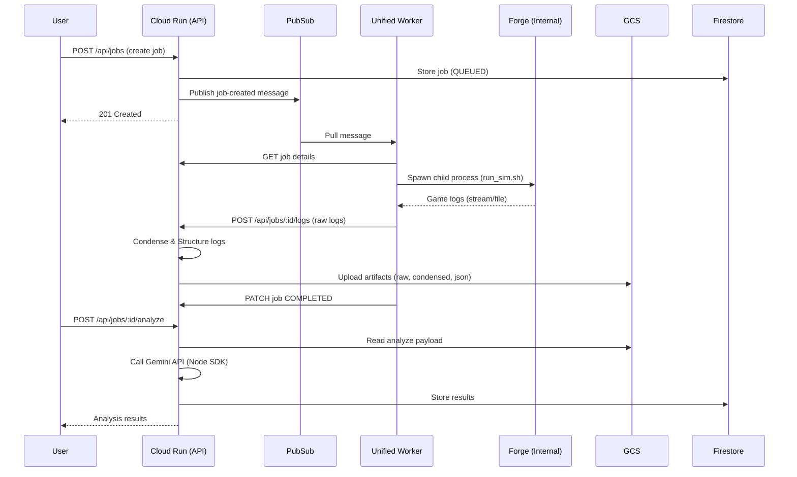
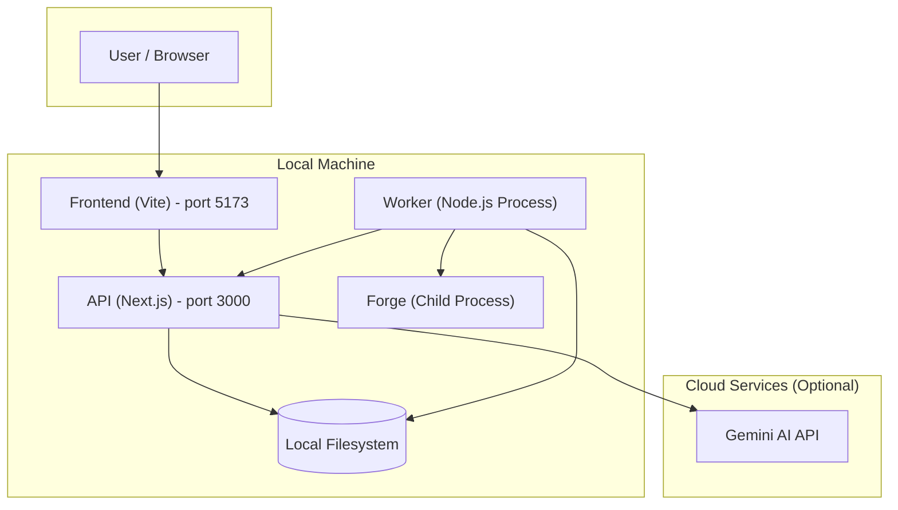
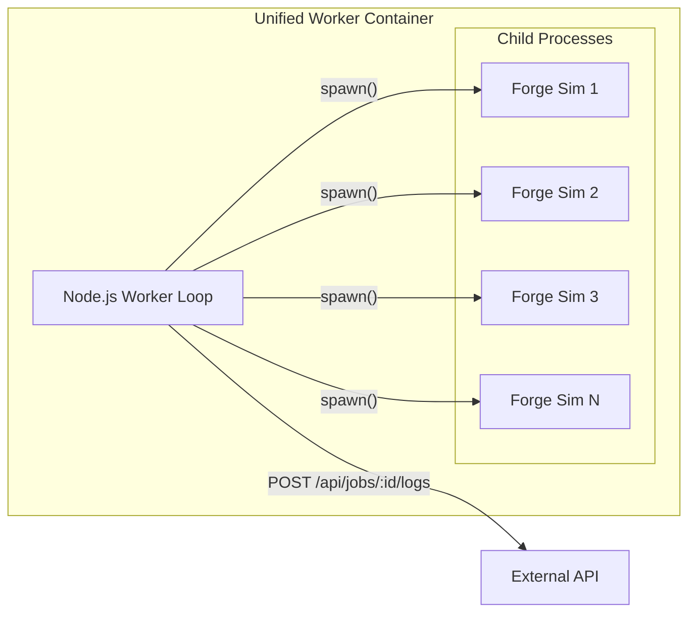

# Magic Bracket Simulator — Architecture Overview
Last Updated: 2024-05-22

This document describes the system architecture, focusing on the "Unified Worker" model and API-driven analysis.

---

## Deployment Modes

The system supports two deployment modes:

1. **Local Development** - All services run locally (Node.js processes).
2. **GCP Cloud Deployment** - Cloud Run API with a Docker-based worker on VM/Container optimized OS.

---

## GCP Cloud Architecture (Production)

In GCP mode, the heavy lifting (simulation) is offloaded to a worker via Pub/Sub, while the API handles coordination and analysis.

```mermaid
flowchart TB
    subgraph gcp [GCP Cloud - Free Tier]
        CloudRun[Cloud Run<br/>Next.js API + Frontend]
        Firestore[(Firestore)]
        GCS[(Cloud Storage)]
        PubSub[Pub/Sub]
        FirebaseAuth[Firebase Auth]

        CloudRun --> Firestore
        CloudRun --> GCS
        CloudRun --> PubSub
        FirebaseAuth --> CloudRun
    end

    subgraph worker_env [Worker Environment (VM or Container)]
        UnifiedWorker[Unified Worker Container<br/>(Node + Java + Forge)]
        ForgeProc[Forge Process (Internal)]

        UnifiedWorker --> ForgeProc
    end

    User --> CloudRun
    PubSub -.-> UnifiedWorker
    UnifiedWorker -->|"POST logs"| CloudRun
```

### GCP Components

| Component | Service | Purpose |
|-----------|---------|---------|
| **API + Frontend** | Cloud Run | Single Next.js app serving UI, API routes, and Analysis logic. |
| **Job Metadata** | Firestore | Stores job state (QUEUED, RUNNING, COMPLETED), deck references, and results. |
| **Artifacts** | Cloud Storage | Stores raw game logs, condensed JSON data, and analysis payloads. |
| **Job Queue** | Pub/Sub | Decouples job creation from execution. Triggers the worker. |
| **Unified Worker** | Compute Engine / Container | A single container image combining Node.js (worker code) and Java (Forge engine). Pulls jobs, runs simulations internally. |

### GCP Data Flow



---

## Local Development Architecture

In Local Mode, the architecture is simplified. The API and Worker run as local Node.js processes, and data is stored on the local filesystem.



### Local Components

| Component | Port | Role |
|-----------|------|------|
| **Frontend** | 5173 | Web UI (Vite + React). Calls API. |
| **API** | 3000 | Next.js API. Handles job creation, log ingestion, and Gemini analysis. Stores data in `data/jobs.db` (SQLite) and `logs-data/` (Filesystem). |
| **Worker** | — | Node.js script (`worker/src/worker.ts`). Polls API for jobs, spawns local Forge process. |
| **Forge** | — | The simulation engine (Java), executed directly by the worker via `spawn`. |

---

## The Unified Worker

The system uses a **Unified Worker** architecture, replacing the legacy multi-container Docker setup.

### Key Characteristics
1.  **Single Container Image**: The worker image (`worker/Dockerfile`) is built on `eclipse-temurin:17-jre-jammy` (Java Runtime) and installs Node.js 20. This allows it to run both the Node worker code and the Java-based Forge engine in the same environment.
2.  **No Docker-in-Docker**: The worker does *not* spawn sibling containers. Instead, it uses Node.js `child_process.spawn` to execute the Forge shell script (`run_sim.sh`) directly.
3.  **Internal Parallelism**: The worker manages parallelism internally. If a job requires 4 parallel simulations, the single worker process spawns 4 concurrent Forge child processes.
4.  **Log Handling**: The worker captures logs from the child processes and POSTs them to the API. It does not upload to GCS directly; the API handles storage abstraction (Local FS vs GCS).



---

## Repository Layout

| Directory | Purpose |
|-----------|---------|
| **frontend/** | React UI (Vite + Tailwind). |
| **api/** | Next.js Application. Contains API routes, job logic, Gemini analysis (`lib/gemini.ts`), and log processing (`lib/log-store.ts`). |
| **worker/** | The Unified Worker source code. Contains `src/worker.ts`, `forge-engine/` (scripts), and `Dockerfile`. |
| **docs/** | Documentation. |
| **scripts/** | Shared automation scripts. |

---

## Key Code References

- **Worker Logic**: `worker/src/worker.ts` — Main loop, polling/PubSub handling, and `runForgeSim` (spawn logic).
- **Log Ingestion**: `api/lib/log-store.ts` — Handles receiving logs from worker, condensing them, and storing them (Local or GCS).
- **Analysis**: `api/lib/gemini.ts` — Generates prompts and calls Google Generative AI.
- **Job Store**: `api/lib/job-store.ts` — Abstracted job storage (Firestore vs SQLite).
