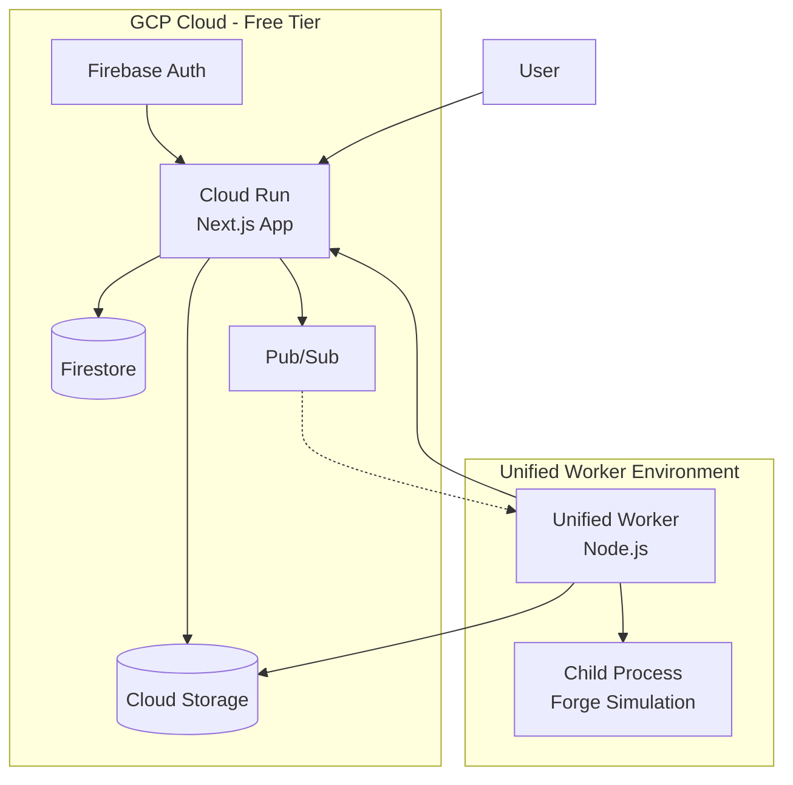
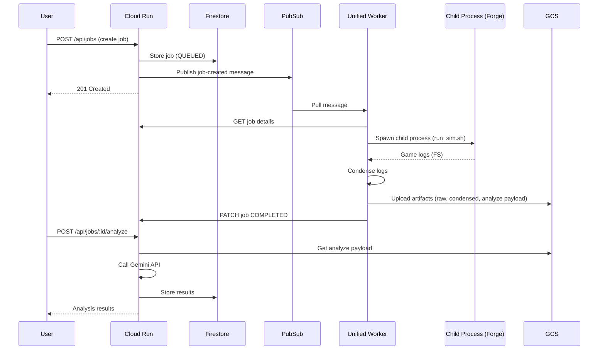
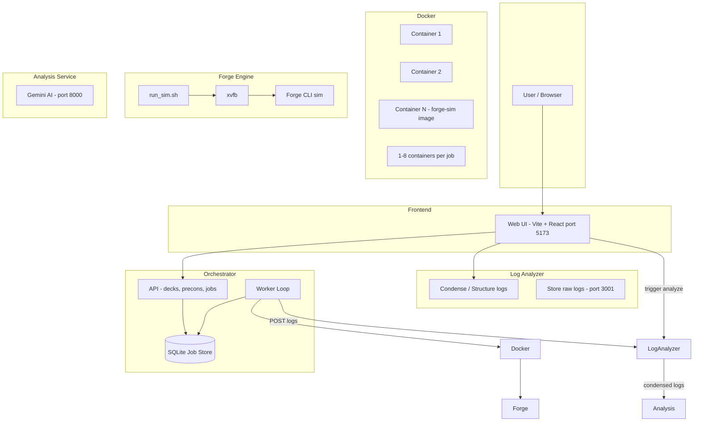
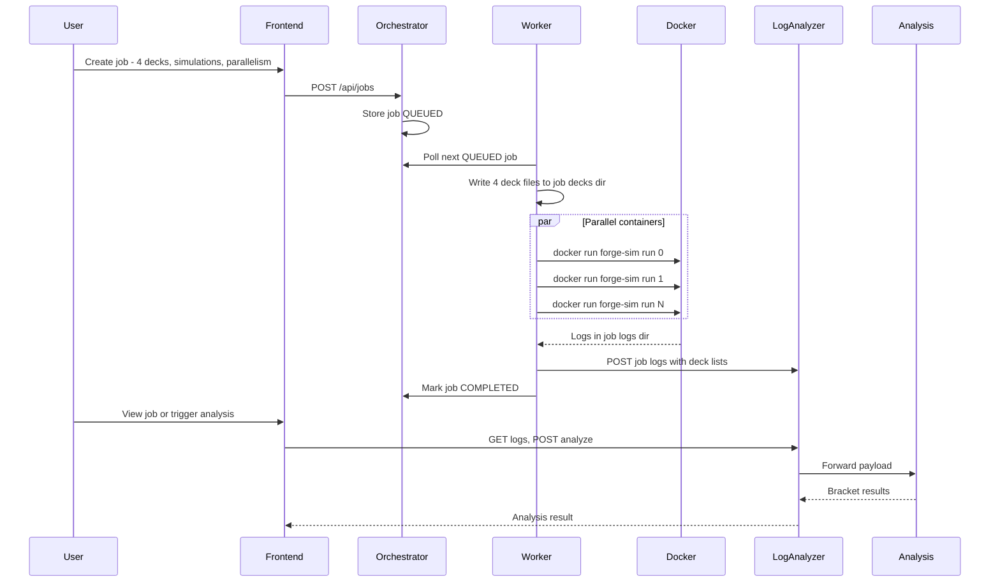
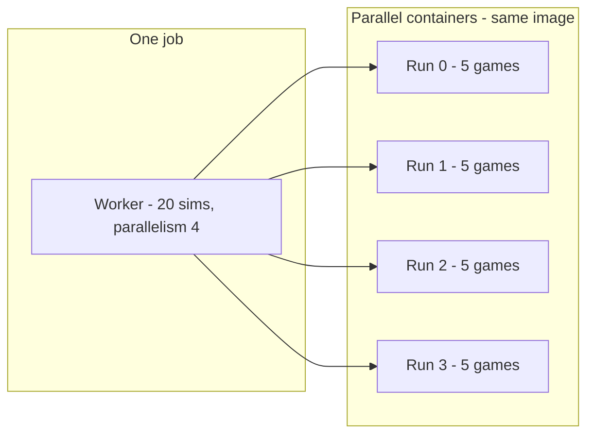
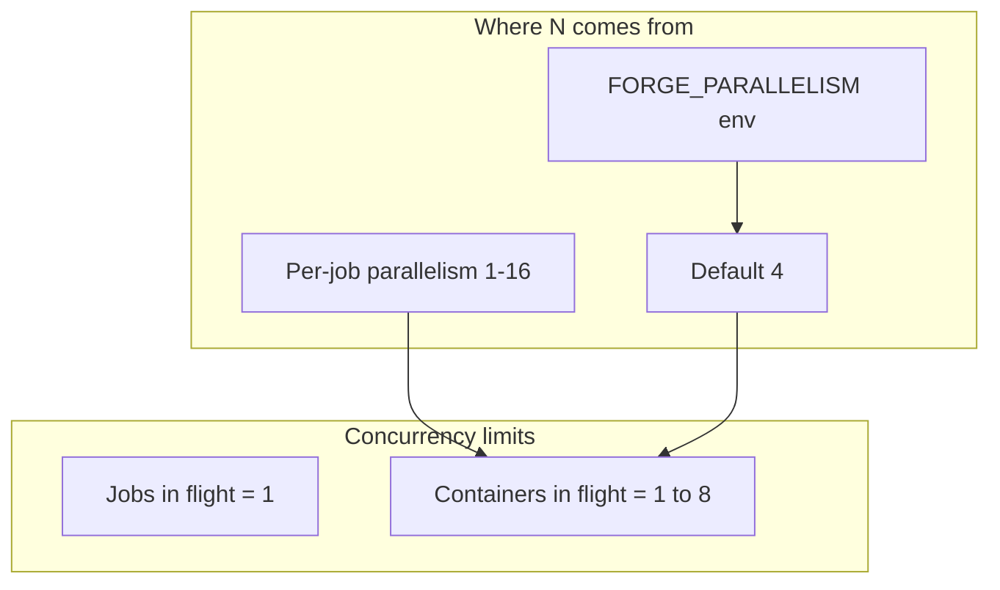

# Magic Bracket Simulator — Architecture Overview

This document describes the system architecture, with emphasis on the Docker-based Forge engine and how parallel execution works.

---

## Deployment Modes

The system supports two deployment modes:

1. **Local Development** - All services run locally (original architecture), orchestrated by the Next.js service.
2. **GCP Cloud Deployment** - Cloud Run API with a "Unified Worker" running simulations.

---

## GCP Cloud Architecture (Recommended for Production)

### GCP Components

| Component | Service | Purpose |
|-----------|---------|---------|
| **API + Frontend** | Cloud Run | Single Next.js app serving API routes and optional frontend |
| **Job Metadata** | Firestore | Job state, deck references, results |
| **Artifacts** | Cloud Storage | Raw logs, condensed logs, analysis payloads |
| **Job Queue** | Pub/Sub | Triggers workers when jobs are created |
| **Authentication** | Firebase Auth | Google sign-in with email allowlist |
| **Secrets** | Secret Manager | Gemini API key and other secrets |

### Local Components (GCP Mode)

| Component | Directory | Purpose |
|-----------|-----------|---------|
| **Unified Worker** | `local-worker/` | Pulls from Pub/Sub, executes simulations as **child processes**, condenses logs, and uploads to GCS. |
| **Forge Engine** | `forge-simulation-engine/` | The underlying simulation logic (Java) executed by the worker. |
| **Misc Runner** | `misc-runner/` | (Legacy) Replaced by internal logic in Unified Worker. |

### GCP Data Flow

---

## Local Development Architecture (Original)

## High-Level Architecture

---

## Component Summary

| Component | Port | Role |
|-----------|------|------|
| **Frontend** | 5173 | Web UI (Vite + React). Calls Orchestrator API and Log Analyzer. |
| **Orchestrator** | 3000 | Next.js API (decks, precons, jobs) + background Worker. Job store in SQLite. |
| **Log Analyzer** | 3001 | Ingests logs from Worker; condenses/structures; stores; can forward to Analysis Service. |
| **Analysis Service** | 8000 | Python + Gemini. On-demand AI analysis of condensed logs. |
| **Forge (Docker)** | — | One image `forge-sim`; multiple containers run in parallel per job. |

---

## Data Flow

---

## Docker and Forge Engine

### One Image, Multiple Containers per Job (Local Development Mode)

- **Single image**: `forge-sim`, built from `forge-simulation-engine/Dockerfile` (Eclipse Temurin 17, Forge release, xvfb, precons, `run_sim.sh` entrypoint).
- **Per job**: The worker spawns **multiple** `docker run` processes **in parallel**. So you get **multiple container instances** at once, all using the same image.

- **Simulation split**: Total simulations are divided across `parallelism` runs (e.g. 20 sims, parallelism 4 → four containers with 5 games each). Each container gets the same deck mount but a distinct `--id` (e.g. `job_<id>_run0`, `job_<id>_run1`) so log filenames don’t clash.
- **Volumes**: Each `docker run` mounts the same job dirs: `jobs/<jobId>/decks` → `/app/decks`, `jobs/<jobId>/logs` → `/app/logs`. All containers write into the same logs directory with different filename prefixes.

### Forge Inside the Container

Each container runs the same flow:

| Step | What happens |
|------|----------------|
| **Entrypoint** | `/app/run_sim.sh` (`forge-simulation-engine/run_sim.sh`) |
| **Input** | `/app/decks` (mounted from worker’s `jobs/<jobId>/decks/`) with 4 `.dck` files; `--id` and `--simulations` per run |
| **Execution** | Copies decks into Forge’s Commander deck path; runs Forge under **xvfb** (virtual display): `xvfb-run ... forge.sh sim -d ... -f Commander -n <simulations> -c 300` |
| **Output** | Logs written under `/app/logs` (mounted from worker’s `jobs/<jobId>/logs/`) as `{runId}_game_1.txt`, etc. Worker reads these after all containers exit |

---

## Parallelism and Limits

### How Many Parallel Tasks?

- **Jobs**: The worker processes **one job at a time**. It’s a single loop: pick next QUEUED job → `await processJob(job)` → repeat. So there is no parallel execution of **different** jobs.
- **Containers (within one job)**: For the **current** job, the worker runs up to **N** containers in parallel, where **N = that job’s parallelism** (or default/env).

### Where the Parallelism Value Comes From

| Source | Description |
|--------|-------------|
| **Default** | `DEFAULT_PARALLELISM = 4` in `orchestrator-service/worker/worker.ts` |
| **Environment** | `FORGE_PARALLELISM` overrides the default if set |
| **Per job** | Request body when creating the job can send `parallelism` (frontend does this); validated to 1–16 |

Effective parallelism for a job: `job.parallelism ?? FORGE_PARALLELISM ?? 4`, clamped by the 1–16 API validation.

### Explicit Limits

| Limit | Value | Location |
|-------|--------|----------|
| **Per-job parallelism** | 1–16 | `PARALLELISM_MIN` / `PARALLELISM_MAX` in `orchestrator-service/lib/types.ts` |
| **Max concurrent Docker containers** | Same as current job’s parallelism | 1–16 |
| **Concurrent jobs** | 1 | Worker loop processes a single job at a time |

There is **no** explicit global “max concurrent containers across all jobs” — effectively it’s “one job at a time, up to 16 containers for that job.” The next job starts only after the current one finishes. Beyond that, the real ceiling is host CPU/memory and Docker daemon limits.

---

## Repo Layout (reference)

| Directory | Purpose | Mode |
|-----------|---------|------|
| **frontend/** | Web UI (Vite + React) with Firebase Auth | Both |
| **orchestrator-service/** | Next.js API: decks, precons, jobs, Gemini analysis | Both |
| **local-worker/** | "Unified Worker": Pulls from Pub/Sub, executes sims as child processes | GCP |
| **misc-runner/** | (Legacy) Go container: condenses logs, uploads to GCS | GCP (Old) |
| **forge-simulation-engine/** | Docker-based Forge simulation runner | Both |
| **forge-log-analyzer/** | Log condensing service (Local Dev) | Local Dev |
| **analysis-service/** | Python + Gemini (Local Dev) | Local Dev |

---

## Quick Reference: Key Code

- **Worker parallelism and Docker spawn (Local Dev)**: `orchestrator-service/worker/worker.ts` — `splitSimulations`, `processJob`, `runForgeDocker`.
- **Unified Worker execution (GCP)**: `local-worker/src/worker.ts` — `processJob`, `runForgeSim` (child process), `processAndUploadLogs`.
- **Job store and types**: `orchestrator-service/lib/job-store.ts`, `orchestrator-service/lib/types.ts` — `PARALLELISM_MIN` / `PARALLELISM_MAX`, `createJob(..., parallelism?)`.
- **Forge container entrypoint**: `forge-simulation-engine/run_sim.sh`.
- **Image build**: `forge-simulation-engine/Dockerfile`.
