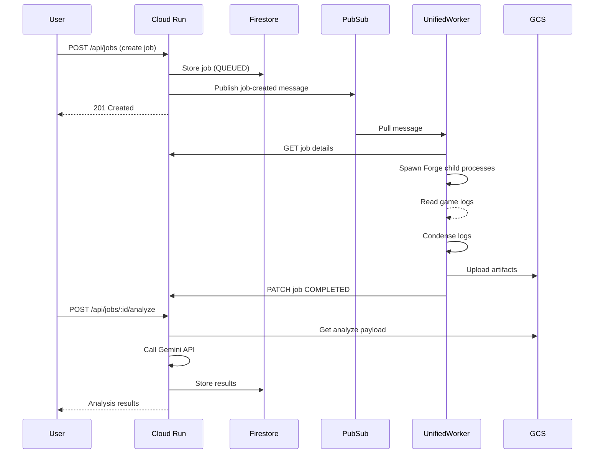
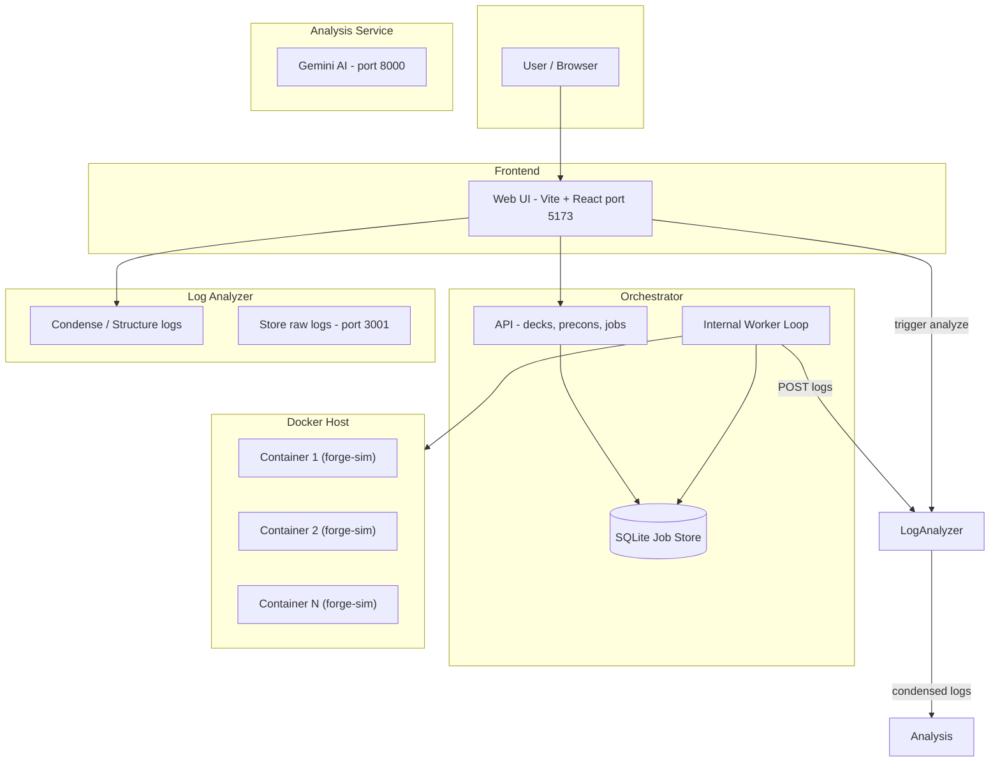

# Magic Bracket Simulator — Architecture Overview

This document describes the system architecture, highlighting the differences between Local Development and GCP Production modes.

---

## Deployment Modes

The system supports two deployment modes:

1. **Local Development** - All services run locally, using Docker to isolate Forge simulations.
2. **GCP Cloud Deployment** - Cloud Run API with a **Unified Worker** running locally or on a VM.

---

## GCP Cloud Architecture (Recommended for Production)

In GCP Mode, the system uses a **Unified Worker** approach. Instead of orchestrating multiple Docker containers, a single worker container includes the Node.js worker code, Java runtime, and Forge engine. It executes simulations as internal child processes.

```mermaid
flowchart TB
    subgraph gcp [GCP Cloud - Free Tier]
        CloudRun[Cloud Run<br/>Next.js App]
        Firestore[(Firestore)]
        GCS[(Cloud Storage)]
        PubSub[Pub/Sub]
        FirebaseAuth[Firebase Auth]
        CloudRun --> Firestore
        CloudRun --> GCS
        CloudRun --> PubSub
        FirebaseAuth --> CloudRun
    end

    subgraph worker_env [Unified Worker Environment]
        UnifiedWorker[Unified Worker Container<br/>(Node + Java + Forge)]
        UnifiedWorker -->|Child Process| ForgeSim1[Forge Sim Process]
        UnifiedWorker -->|Child Process| ForgeSim2[Forge Sim Process]
    end

    User --> CloudRun
    PubSub -.-> UnifiedWorker
    UnifiedWorker --> GCS
    UnifiedWorker --> CloudRun
```

### GCP Components

| Component | Service | Purpose |
|-----------|---------|---------|
| **API + Frontend** | Cloud Run | Single Next.js app serving API routes and optional frontend |
| **Job Metadata** | Firestore | Job state, deck references, results |
| **Artifacts** | Cloud Storage | Raw logs, condensed logs, analysis payloads |
| **Job Queue** | Pub/Sub | Triggers workers when jobs are created |
| **Authentication** | Firebase Auth | Google sign-in with email allowlist |
| **Secrets** | Secret Manager | Gemini API key, Worker secrets |

### Unified Worker (GCP Mode)

| Component | Source | Purpose |
|-----------|-----------|---------|
| **Unified Worker** | `local-worker/` + `unified-worker/` | Single container that pulls from Pub/Sub, runs Forge simulations internally, and uploads results to GCS. |

### GCP Data Flow



---

## Local Development Architecture (Original)

In Local Mode, the Orchestrator Service runs its own internal worker loop that spawns **Docker containers** for isolation.



---

## Parallelism and Limits

### How Many Parallel Tasks?

- **Jobs**: Both modes process **one job at a time** per worker instance.
- **Simulations**: Within a job, simulations are split across parallel execution units.

### Parallelism Implementation

| Feature | Local Mode | GCP Mode (Unified Worker) |
|---------|------------|---------------------------|
| **Execution Unit** | Docker Container (`forge-sim`) | Child Process (`/bin/bash run_sim.sh`) |
| **Orchestration** | `docker run` via `spawn` | `spawn` directly |
| **Max Parallelism** | Limited by Docker/Host CPU | Limited by Host CPU/Memory |
| **Isolation** | High (Container) | Medium (Process) |

---

## Repo Layout (reference)

| Directory | Purpose | Mode |
|-----------|---------|------|
| **frontend/** | Web UI (Vite + React) with Firebase Auth | Both |
| **orchestrator-service/** | Next.js API: decks, precons, jobs, Gemini analysis | Both |
| **local-worker/** | Source code for the Unified Worker | GCP |
| **unified-worker/** | Dockerfile for packaging Local Worker + Forge | GCP |
| **forge-simulation-engine/** | Base resources and `forge-sim` Dockerfile | Local / Base for Unified |
| **misc-runner/** | (Legacy) Log condensing tool | Deprecated |
| **forge-log-analyzer/** | (Legacy) Log condensing service | Local only |
| **analysis-service/** | (Legacy) Python + Gemini | Local only |

---

## Quick Reference: Key Code

- **GCP Worker Logic**: `local-worker/src/worker.ts` — `processJob`, `runForgeSim` (process spawn), `processAndUploadLogs`.
- **Local Worker Logic**: `orchestrator-service/worker/worker.ts` — `processJob`, `runForgeDocker` (docker spawn).
- **Unified Image**: `unified-worker/Dockerfile` — Combines Node, Java, Forge.
- **Job Store**: `orchestrator-service/lib/job-store.ts` (SQLite) vs `firestore-job-store.ts`.
