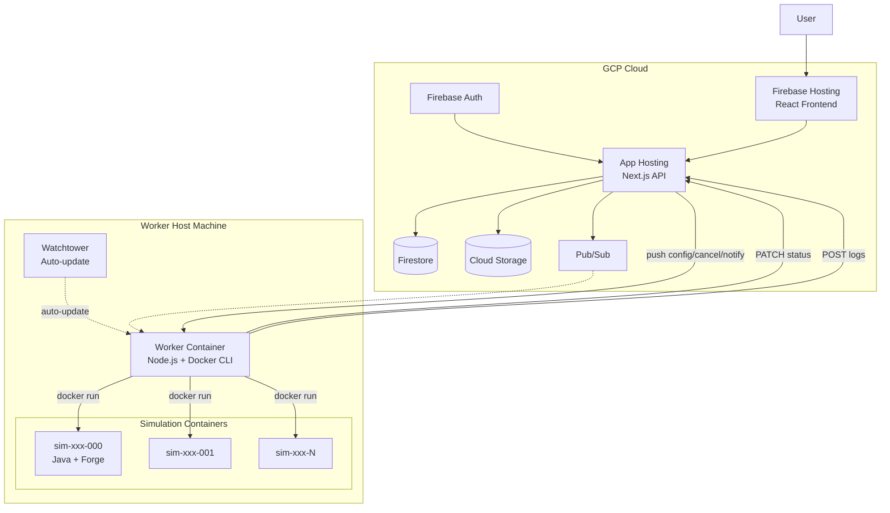
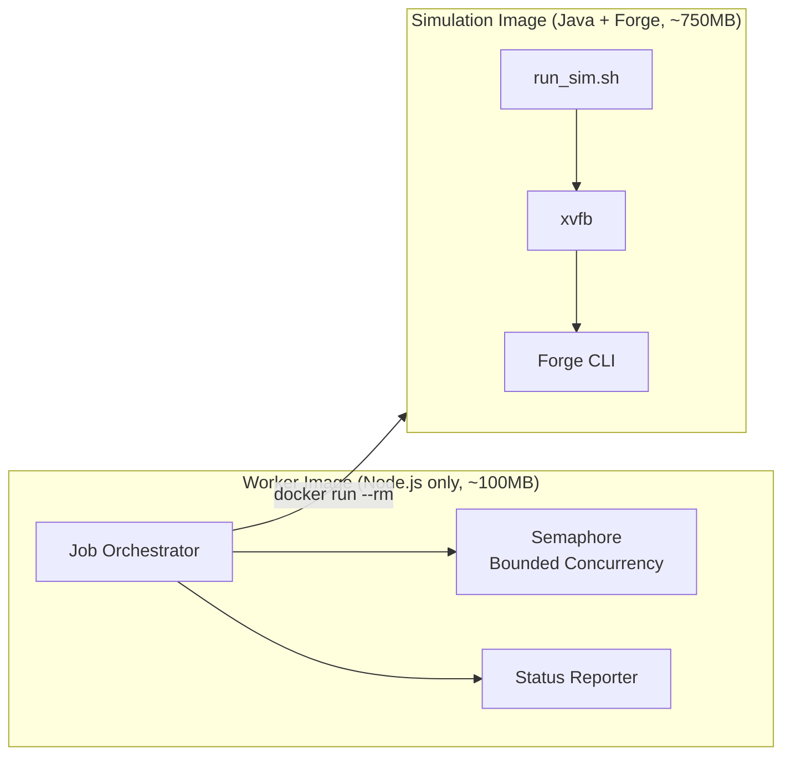
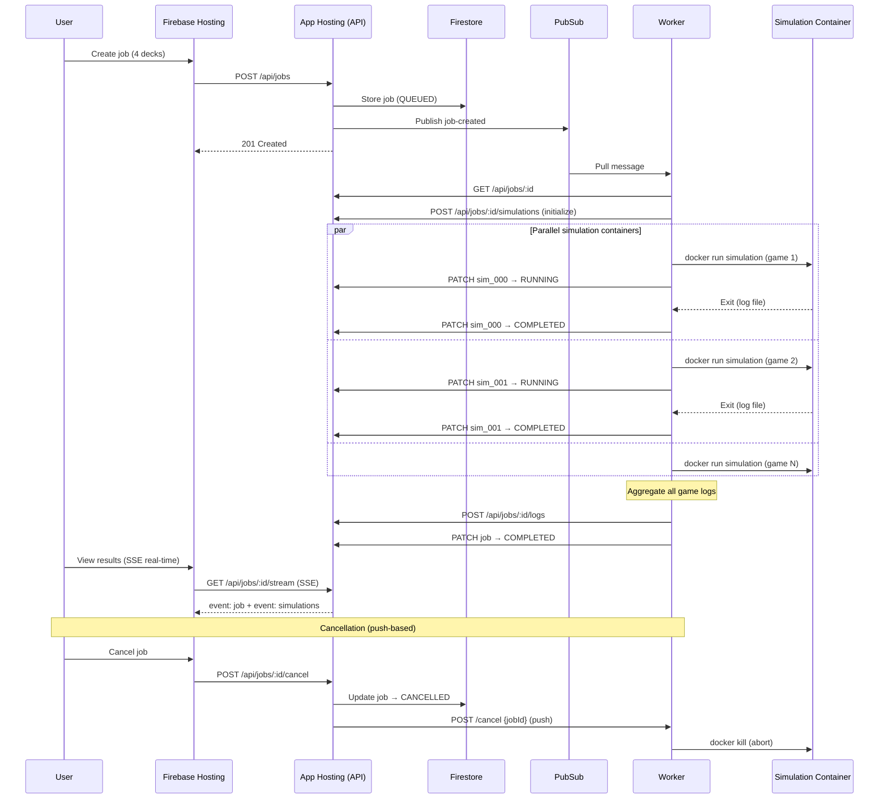
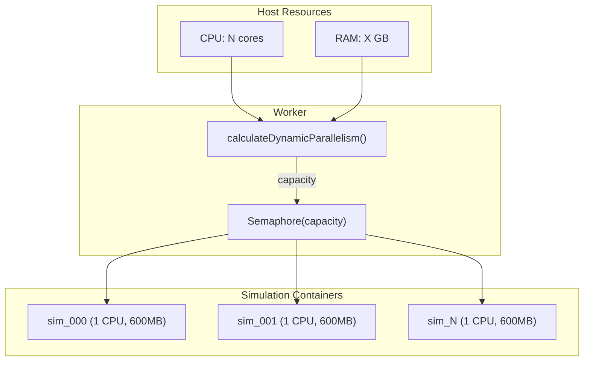
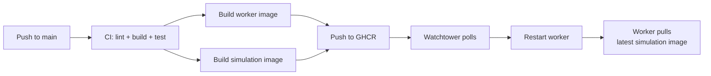

# Magic Bracket Simulator — Architecture Overview
Last Updated: 2026-02-19

This document describes the system architecture, including the Worker + Simulation split design for parallel, resource-aware simulation execution.

---

## Deployment Modes

The system supports two deployment modes, auto-detected by the `GOOGLE_CLOUD_PROJECT` env var:

| Mode | Storage | Queue | Auth | Worker Transport |
|------|---------|-------|------|------------------|
| **Local** (env unset) | SQLite + filesystem | HTTP polling | None | `GET /api/jobs/next` |
| **GCP** (env set) | Firestore + Cloud Storage | Pub/Sub | Firebase Auth | Pub/Sub pull subscription |

---

## GCP Cloud Architecture (Production)



### GCP Components

| Component | Service | Purpose |
|-----------|---------|---------|
| **API** | App Hosting | Next.js app serving API routes |
| **Frontend** | Firebase Hosting | React SPA |
| **Job Metadata** | Firestore | Job state, deck references, simulation statuses, results |
| **Artifacts** | Cloud Storage | Raw logs, condensed logs, structured logs |
| **Job Queue** | Pub/Sub | Triggers workers when jobs are created |
| **Authentication** | Firebase Auth | Google sign-in with email allowlist |
| **Secrets** | Secret Manager | Worker config |

### Worker Host Components

| Component | Image | Purpose |
|-----------|-------|---------|
| **Worker** | `ghcr.io/.../worker` (~100MB) | Node.js orchestrator: receives jobs, spawns simulation containers, aggregates logs. Exposes port 9090 for push-based API control (config, cancel, notify, drain) |
| **Simulation** | `ghcr.io/.../simulation` (~750MB) | Java 17 + Forge + xvfb: runs exactly 1 game, writes log, exits |
| **Watchtower** | `nickfedor/watchtower` | Polls GHCR for new worker images, auto-restarts |

---

## Two-Image Architecture: Worker + Simulation

The worker and simulation concerns are split into two Docker images:



### Why Two Images?

| Benefit | Description |
|---------|-------------|
| **Per-simulation progress** | Each game reports status independently via API |
| **Failure isolation** | 1 crashed simulation does not lose the entire job |
| **Resource-aware scaling** | Worker fills available CPU/RAM dynamically |
| **Faster worker updates** | Worker image is ~100MB vs ~800MB monolithic |
| **Multi-machine scaling** | Add a machine, run `setup-worker.sh`, done |

### Container Mode vs Monolithic Mode

The worker supports two execution modes (auto-detected):

| Mode | Detection | Behavior |
|------|-----------|----------|
| **Container** (default) | `FORGE_PATH` not set | Spawns Docker containers (1 per game) |
| **Monolithic** (legacy) | `FORGE_PATH` set | Runs Forge as child processes (old behavior) |

---

## Data Flow

### GCP Mode



### Per-Simulation Status Flow

The API tracks individual simulation states via a Firestore subcollection (`jobs/{id}/simulations/{simId}`):

| Simulation State | Meaning |
|-----------------|---------|
| `PENDING` | Initialized, waiting for worker |
| `RUNNING` | Container started, game in progress |
| `COMPLETED` | Game finished successfully |
| `FAILED` | Container crashed or timed out |

The frontend receives real-time updates via SSE events and renders a `SimulationGrid` component.

---

## Worker Concurrency Model



### Resource Calculation

```
cpuLimit  = max(1, totalCPUs - 2)        // Reserve 2 cores for system + worker
memLimit  = floor((freeMB - 2048) / 600)  // Reserve 2GB, 600MB per sim
capacity  = min(requested, cpuLimit, memLimit)
```

Each simulation container is constrained to `--memory=600m --cpus=1`.

The semaphore capacity can be dynamically overridden via the worker's push API (`POST /config`). When a user changes the override in the frontend, the API pushes the new value directly to the worker — no need to wait for the next heartbeat poll.

### Concurrency Differences

| Aspect | Container Mode | Monolithic Mode (legacy) |
|--------|---------------|-------------------------|
| Jobs in flight | Multiple (Pub/Sub maxMessages = capacity) | 1 at a time |
| Sims per job | 1 container per game | N games per child process |
| Isolation | Full (separate containers) | Shared filesystem |
| Progress | Per-simulation API updates | Batch-level only |

---

## Simulation Container Lifecycle

Each simulation container:

1. Receives deck files via read-only volume mount
2. Copies decks into Forge's Commander deck directory
3. Starts xvfb (virtual display)
4. Runs Forge CLI: `forge.sh sim -d deck1 deck2 deck3 deck4 -f Commander -n 1 -c 300`
5. Writes game log to output volume mount
6. Exits (container auto-removed via `--rm`)

```bash
docker run --rm \
  --name sim-<jobId>-sim_000 \
  --memory=600m --cpus=1 \
  -v /tmp/mbs-jobs/<jobId>/decks:/home/simulator/.forge/decks/commander:ro \
  -v /tmp/mbs-jobs/<jobId>/logs:/app/logs \
  simulation:latest \
  --decks deck_0.dck deck_1.dck deck_2.dck deck_3.dck \
  --simulations 1 \
  --id <jobId>_sim_000
```

---

## CI/CD Pipeline



### Image Update Flow

1. Code pushed to `main` triggers CI + deploy workflow
2. Both `worker` and `simulation` images are built and pushed to GHCR
3. Watchtower detects new worker image, restarts the worker container
4. On startup, worker calls `ensureSimulationImage()` to pull the latest simulation image
5. New simulation containers use the updated image

---

## Repo Layout

| Directory | Purpose |
|-----------|---------|
| **frontend/** | React SPA (Vite + Tailwind v4 + Firebase Auth) |
| **api/** | Next.js 15 API: jobs, decks, simulations |
| **worker/** | Node.js orchestrator: Pub/Sub/polling, container management |
| **worker/forge-engine/** | Forge assets: `run_sim.sh`, precon decks |
| **simulation/** | Simulation image Dockerfile (references `worker/forge-engine/`) |
| **scripts/** | Setup and provisioning scripts |
| **docs/** | Architecture and implementation docs |

---

## Key Code References

| Concept | Location |
|---------|----------|
| Worker orchestration | `worker/src/worker.ts` — `processJobWithContainers`, `runSimulationContainer`, `Semaphore` |
| Dynamic parallelism | `worker/src/worker.ts` — `calculateDynamicParallelism` |
| Legacy monolithic mode | `worker/src/worker.ts` — `processJobMonolithic`, `runForgeSim` |
| Simulation types | `api/lib/types.ts` — `SimulationState`, `SimulationStatus` |
| Simulation CRUD (Firestore) | `api/lib/firestore-job-store.ts` — `initializeSimulations`, `updateSimulationStatus` |
| Simulation CRUD (SQLite) | `api/lib/job-store.ts` — simulation table operations |
| Simulation API endpoints | `api/app/api/jobs/[id]/simulations/` — GET, POST, PATCH |
| SSE stream (with simulations) | `api/app/api/jobs/[id]/stream/route.ts` |
| Frontend simulation grid | `frontend/src/components/SimulationGrid.tsx` |
| Frontend SSE hook | `frontend/src/hooks/useJobStream.ts` |
| Forge container entrypoint | `worker/forge-engine/run_sim.sh` |
| Worker Dockerfile | `worker/Dockerfile` |
| Simulation Dockerfile | `simulation/Dockerfile` |
| CI/CD deploy | `.github/workflows/deploy-worker.yml` |
| Worker HTTP API | `worker/src/worker-api.ts` — push-based control endpoints (config, cancel, notify, drain, health) |
| Worker push helper | `api/lib/worker-push.ts` — `pushToWorker`, `pushToAllWorkers` |
| Worker provisioning | `scripts/setup-worker.sh`, `scripts/populate-worker-secret.js` |
