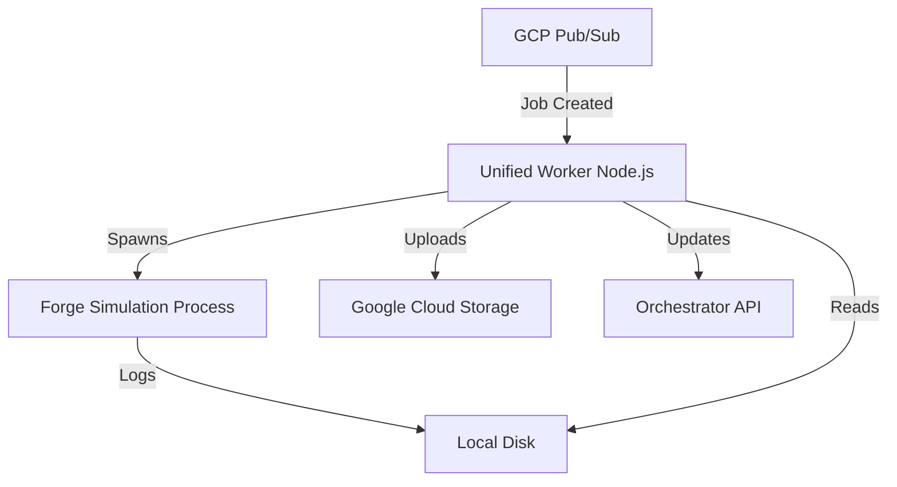

# Unified Worker (Source: local-worker)

This directory contains the source code for the **Unified Worker**, which powers the GCP Mode of the application.

Previously known as "Local Worker", this service has been evolved into a "Unified Worker" that handles the entire simulation lifecycle internally, without orchestrating external Docker containers.

## Architecture

The Unified Worker is a single container that packages:
1.  **Node.js**: Runs the worker logic (pulls from Pub/Sub, updates API).
2.  **Java (JRE)**: Runtime for Forge.
3.  **Forge Engine**: The MTG simulation binary.



## Running the Worker

### Option 1: Docker (Recommended)

To run the worker in a container that mimics the production environment (GCP Cloud Run / Compute Engine), use the `unified-worker` configuration:

```bash
cd ../unified-worker
docker-compose up --build
```

This builds a single image containing Node.js, Java, and Forge, and runs it with your local credentials.

### Option 2: Local Node.js (Development)

You can run the worker directly on your host machine for faster development cycles, but you must have **Java** and **Forge** installed manually.

1.  **Install Prerequisites**:
    -   Node.js 20+
    -   Java 17+ (JRE)
    -   [Forge](https://github.com/Card-Forge/forge/releases) extracted to a folder.

2.  **Configure Environment**:
    Set `FORGE_PATH` to your local Forge installation.

    ```bash
    export FORGE_PATH=/path/to/forge
    # Ensure /path/to/forge/run_sim.sh exists and is executable
    ```

3.  **Run**:
    ```bash
    npm install
    npm run build
    npm run dev
    ```

## Configuration

The worker is configured via environment variables or Google Secret Manager.

| Variable | Description | Default |
|----------|-------------|---------|
| `GOOGLE_CLOUD_PROJECT` | GCP Project ID | `magic-bracket-simulator` |
| `PUBSUB_SUBSCRIPTION` | Pub/Sub subscription to pull from | `job-created-worker` |
| `API_URL` | Orchestrator API URL | `http://localhost:3000` |
| `FORGE_PATH` | Path to Forge directory | `/app/forge` |
| `GCS_BUCKET` | Cloud Storage bucket for artifacts | `magic-bracket-simulator-artifacts` |
| `WORKER_SECRET` | Shared secret for API authentication | - |

## Legacy Note

This directory was previously responsible for orchestrating `forge-sim` and `misc-runner` Docker containers. That architecture has been replaced by the Unified Worker model to improve performance and simplify deployment on GCP. The `misc-runner` service is now deprecated.
